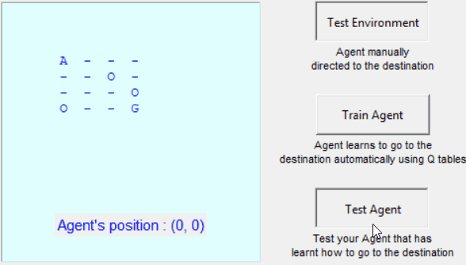

# Simple-RL-QTable

Simple Reinforcement Learning using Q tables. Train an agent to move to its destination

**Dependancy modules: **
- numpy 
- pandas 
- time 
- tkinter - for display purpose 

Just execute the following to train or test: 
>**python test_env.py**
